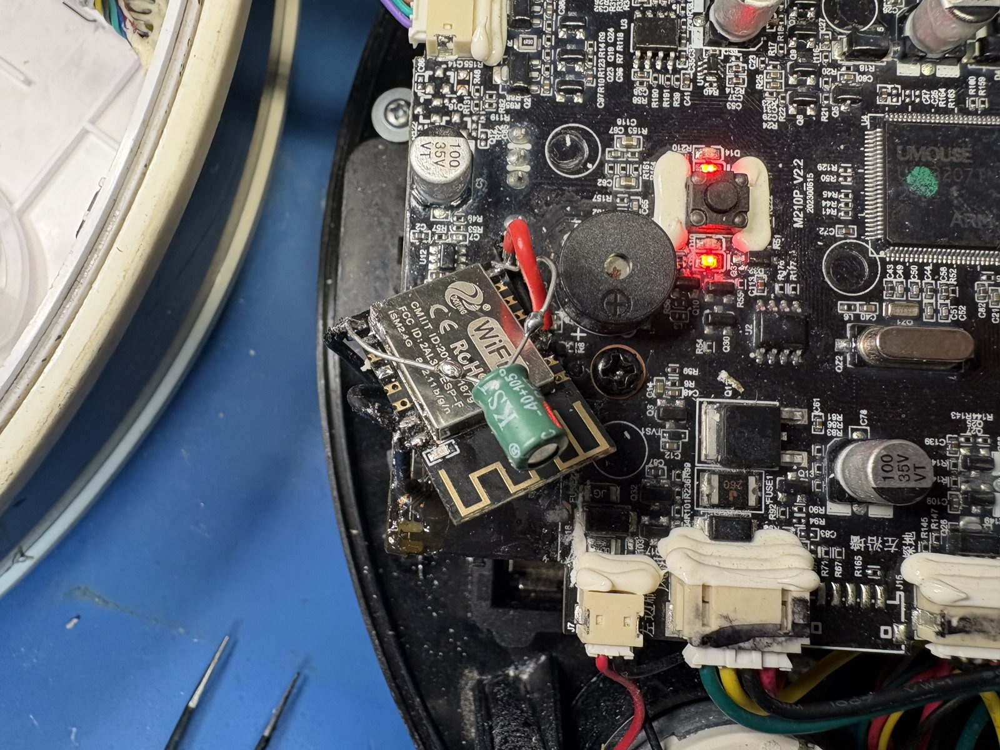
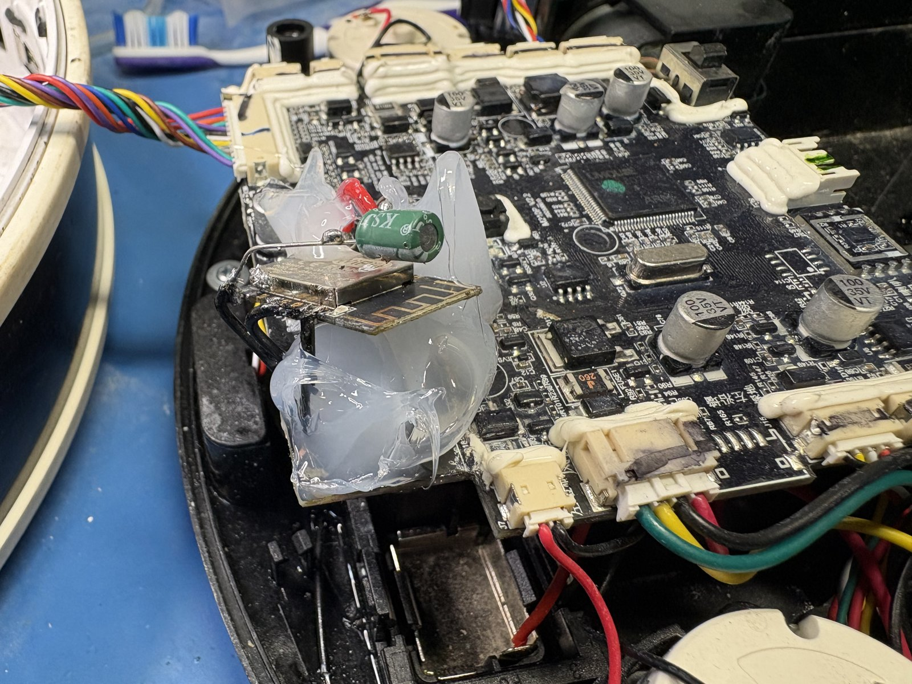

# Lefant M210P with ESPHome

Replaces the Tuya WBR3 module in a Lefant M210P robot vacuum with an ESP-12F
running ESPHome, so it works locally through Home Assistant.



<sub><i>Please ignore my terrible rework job and broken traces</i></sub>

My board is V2.2 of the M210P according to the silkscreen. The ESP12F replaces the
Tuya WBR3 with no rework (if you don't break traces).

## Hardware

| | |
|---|---|
| Vacuum | Lefant M210P, board V2.2 |
| Tuya product id | `cgrfjjwmstsaemw8` |
| Original module | Tuya WBR3, RTL8720CF |
| Replacement | ESP-12F (Adafruit 2491) |
| MCU link | UART0, 115200 8N1 |
| MCU firmware seen | 26.2.43 |

The download pad `PA00` is on the underside of the board so it'd have to come off
to reflash it anyway, would rather replace it.

## Pads

WBR3 left, ESP-12F right. The offset of six is the ESP-12F's extra bottom row.

| WBR3 | ESP-12F | Function | Do |
|---|---|---|---|
| 3 | 3 | EN | solder |
| 8 | 8 | 3V3 | solder |
| 9 | 15 | GND | solder |
| 15 | 21 | RXD0, GPIO3, from MCU TX | solder |
| 16 | 22 | TXD0, GPIO1, to MCU RX | solder |
| 10 | 16 | GPIO15 | leave off, 10k to GND |

## Firmware

```bash
cp esphome/secrets.yaml.example esphome/secrets.yaml
$EDITOR esphome/secrets.yaml          # API key: openssl rand -base64 32
esphome run esphome/lefant-vacuum.yaml
```

Serial logger is off (`baud_rate: 0`) because UART0 belongs to the Tuya component.
Logs come over the network, and the startup dump should say `Hardware UART: NONE`.

First flash wants a USB serial adapter with GPIO0 to GND. After that OTA works,
including in situ. `esphome upload` tries a DTR/RTS reset, so use esptool directly
on a manual rig.

## Datapoints

| DP | Code | Type | Notes |
|---|---|---|---|
| 1 | `power` | bool | |
| 2 | `power_go` | bool | return to dock |
| 3 | `mode` | enum | standby, smart, chargego, random, wall_follow, spiral |
| 4 | `direction_control` | enum | backward, turn_left, turn_right, stop |
| 5 | ? | enum | undocumented |
| 6 | `electricity_left` | int | 0 to 100 % |
| 13 | `seek` | bool | locate beep |
| 16 | `clean_area` | int | m2 |
| 17 | `clean_time` | int | min |
| 18 | `fault` | bitmap | 23 bits |
| 19 | ? | raw | `01:00:FF`, undocumented |
| 101, 111 | ? | enum | undocumented |
| 112 | ? | switch | undocumented |

## Protocol

```
55 AA | ver | cmd | len (2 bytes, big endian) | data | checksum

55 AA 00 00 00 00 FF            module heartbeat
55 AA 03 00 00 01 01 04         MCU heartbeat reply
55 AA 00 01 00 00 00            module product query
55 AA 03 01 00 2C {json} F9     MCU product reply
```

Checksum is the sum of everything before it, mod 256. Product reply payload is
`{"p":"cgrfjjwmstsaemw8","v":"26.2.43","m":2}`. Init runs 0 heartbeat, 1 product,
2 conf, 3 wifi, 4 datapoint, 5 done. Working link sits at 5.

The heartbeat is not 1 Hz. ESPHome arms 15 seconds, retries at the 300 ms receive
timeout for five attempts, logs `Initialization failed`, gives up. You get bursts
of five about 15 seconds apart.

## Licence

MIT, see [LICENSE](LICENSE).



<sub><i>My shame has been encased in silicone, hopefully never to see the light of day again</i></sub>
